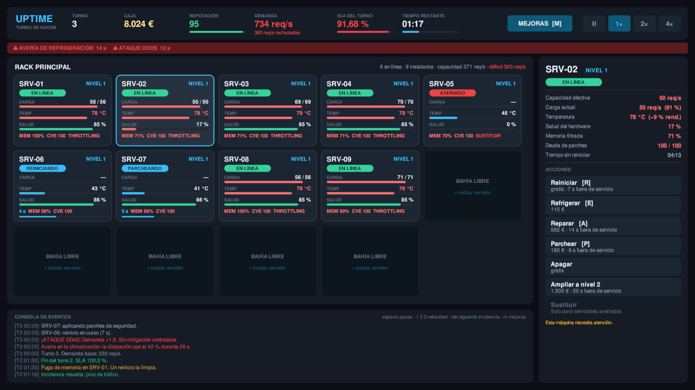
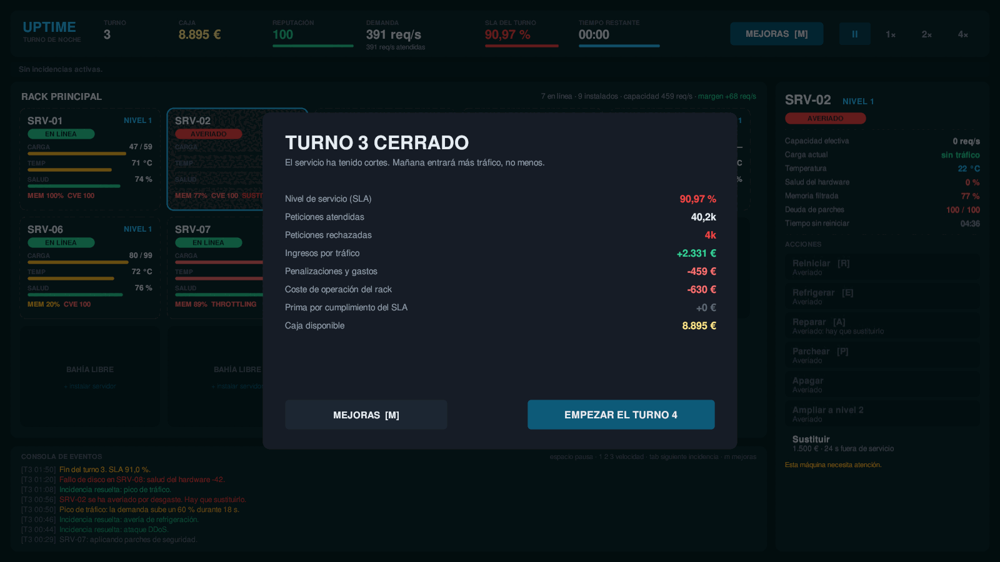
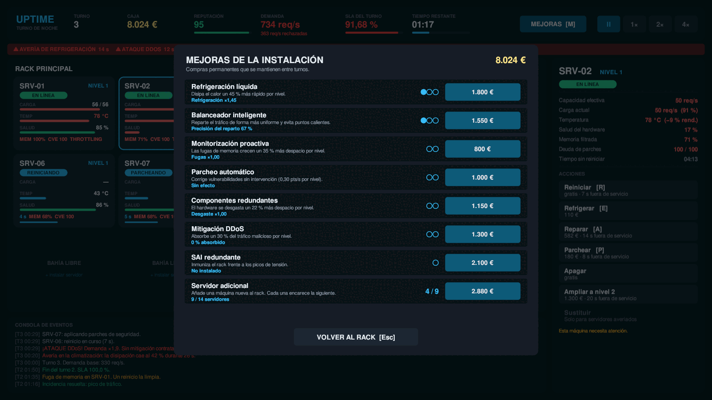

<div align="center">

# UPTIME · Turno de Noche

**Un rack. Un técnico. Toda la noche.**

Simulador de mantenimiento de un centro de datos en tiempo real.
Tú contra la entropía, y la entropía tiene mejor uptime.


</div>

<br>



<div align="center"><sub>Turno 3. Un DDoS y una avería de climatización a la vez. Seis máquinas en <i>throttling</i>, una averiada, dos en mantenimiento y 363 peticiones por segundo cayéndose al suelo.</sub></div>

<br>

---

## El bucle

El balanceador reparte el tráfico entre los servidores que están en línea. Todo lo que no
se atiende cuesta **dinero** y **reputación**. Cada turno entra más tráfico que el anterior.
Si la reputación llega a cero, se acabó el contrato.

Eso es todo. La dificultad no está en las reglas, está en que las cuatro cosas que se rompen
se rompen a la vez y la solución de una empeora las otras.

## Las cuatro amenazas

| | Qué pasa | Cómo se para | Lo que te cuesta |
|:--:|---|---|---|
| 🔥 | **Calor.** Por encima de 76 °C la máquina rinde menos (*throttling*) y se desgasta más rápido | Reparto de carga, refrigeración forzada o refrigeración líquida | 110 € y 16 s de recarga por máquina |
| 🧠 | **Fugas de memoria.** Se comen hasta el 45 % de la capacidad | Solo se limpian reiniciando | 7 s fuera del balanceador |
| 🔓 | **Deuda de parches.** Sube sola. Un escaneo por encima de 45 puntos = brecha | Parchear, o contratar parcheo automático | 180 € y 8 s — o multa y −14 de reputación |
| ⚙️ | **Desgaste.** A 0 % de salud la máquina se avería | Reparar antes; sustituir después | Reparar ≈ 7 €/punto · Sustituir 1.500 € |

Y encima, sin avisar: picos de tráfico, ataques DDoS, fallos de disco, averías de
climatización y picos de tensión que dejan una máquina inservible.

## El dilema central

> Para arreglar un servidor tienes que sacarlo del balanceador.
> Y lo sacas justo cuando más capacidad necesitas.

Mantener margen de capacidad no es prudencia: es la única forma de poder hacer mantenimiento
sin que se caiga el servicio. Ir al límite funciona, hasta que un disco se rompe y ya no
puedes permitirte apagar nada. A partir de ahí solo miras cómo baja el número.

---

## Galería

<table>
<tr>
<td width="50%"><br><sub><b>Cierre de turno.</b> SLA, ingresos, penalizaciones y prima. Los números no mienten.</sub></td>
<td width="50%"><br><sub><b>Mejoras permanentes.</b> Ocho líneas de inversión. Nunca hay dinero para todas.</sub></td>
</tr>
</table>

---

## Jugar

Hay un ejecutable ya compilado:

```bash
./Build/Uptime.x86_64
```

O abre la carpeta desde Unity Hub (*Add project from disk*) con **Unity 6000.0.82f1** y pulsa
**Play**. La escena `Assets/_Project/Scenes/Main.unity` ya está en *Build Settings*.

> El juego arranca incluso desde una escena vacía: si al entrar en modo Play no existe ningún
> `GameBootstrap`, se crea uno solo mediante `[RuntimeInitializeOnLoadMethod]`.

### Controles

| | | | |
|---|---|---|---|
| `Espacio` Pausa | `1` `2` `3` Velocidad ×1 ×2 ×4 | `Tab` Siguiente incidencia | `M` Mejoras |
| `R` Reiniciar | `E` Refrigerar | `A` Reparar | `P` Parchear |
| `Esc` Cerrar tienda | `N` Silenciar | | |

---

## Arquitectura

<details>
<summary><b>Estructura de carpetas</b></summary>

```
Assets/_Project/Scripts/
├── Core/                    Simulación y reglas. C# puro salvo GameBootstrap.
│   ├── GameBootstrap.cs     Punto de entrada. Crea la sesión y la interfaz.
│   ├── GameSession.cs       Estado, ciclo de turnos, acciones, economía.
│   ├── GameConfig.cs        ScriptableObject con todo el equilibrio.
│   ├── ServerUnit.cs        Un servidor: térmica, desgaste, tareas.
│   ├── Rack.cs              Balanceo de carga por llenado.
│   ├── IncidentSystem.cs    Incidencias y efectos temporales.
│   └── Upgrades.cs          Catálogo de mejoras y modificadores.
├── Events/
│   └── GameEvents.cs        Bus de eventos por instancia y sus payloads.
├── UI/                      Interfaz, construida enteramente por código.
│   ├── GameUi.cs            Monta el lienzo y coordina las vistas.
│   ├── Ui.cs                Fábrica de widgets y helpers de anclaje.
│   ├── UiTheme.cs           Paleta y tipografía.
│   ├── HudView.cs           Barra superior y franja de incidencias.
│   ├── RackView.cs          Rejilla de servidores y bahías libres.
│   ├── ServerCardView.cs    Tarjeta de un servidor.
│   ├── InspectorView.cs     Detalle y acciones.
│   ├── LogView.cs           Consola de eventos.
│   ├── UpgradesView.cs      Tienda modal.
│   └── OverlayView.cs       Intro, cierre de turno y fin de partida.
├── Utils/
│   ├── Fmt.cs               Formateo de números y tiempos.
│   ├── TextureFactory.cs    Sprites generados por código (SDF).
│   └── Sfx.cs               Sonido sintetizado.
└── Editor/
    ├── SmokeTest.cs         Prueba de humo y banco de equilibrio.
    ├── SceneBuilder.cs      Escena y asset de configuración.
    ├── BuildTools.cs        Compilación del ejecutable.
    └── ScreenshotTool.cs    Capturas renderizadas a PNG.
```

</details>

### Cinco decisiones que explican el resto del código

**Cero assets binarios.** Los sprites son rectángulos redondeados generados con una función
de distancia con signo, el sonido son tonos sintetizados con envolvente y la tipografía es la
que trae Unity de serie. No hay ni un `.png` ni un `.wav` ni un prefab en todo el proyecto:
la carpeta `Assets/_Project` se copia a otro proyecto y funciona tal cual.

**La lógica no sabe que existe una interfaz.** `GameSession.GetActions(unit)` devuelve qué
acciones hay, cuánto cuestan, cuánto tardan y **por qué** están o no disponibles. La interfaz
solo las pinta. Añadir una acción nueva no obliga a tocar ni una línea de UI.

**Bus de eventos por instancia, no estático.** Un bus estático deja suscriptores colgados
entre partidas cuando el *domain reload* está desactivado, que es el fallo clásico. Los
sucesos puntuales van por el bus; los valores numéricos se leen por sondeo cada frame, que
con este número de widgets sale más simple y más barato.

**Paso de simulación troceado.** `GameSession.Tick` parte el delta en pasos de 50 ms como
máximo. La térmica y el desgaste no dependen de los FPS ni se descuadran a velocidad ×4.

**Realimentación térmica acotada a propósito.** El calor se calcula contra la capacidad
*nominal*, no contra la efectiva. Si no, el *throttling* reduciría la capacidad, lo que
subiría la ocupación, lo que subiría el calor: una espiral de la que es imposible salir.
Así el throttling duele sin ser una sentencia.

---

## Herramientas del editor

Menú **Server Game** en Unity. Todas funcionan también desde línea de comandos.

| Herramienta | Qué hace |
|---|---|
| **Ejecutar prueba de humo** | Juega 5 partidas automáticas, comprueba las invariantes del modelo, construye la interfaz entera y ejercita las 7 acciones y las 8 mejoras. Informa de fallos **y del equilibrio**. |
| **Capturar pantallas** | Renderiza la interfaz a PNG a 1600×900 sin entrar en modo Play. |
| **Compilar ejecutable** | Genera la build de Linux. |
| **Crear escena principal** | Regenera `Main.unity` y la añade a *Build Settings*. |
| **Crear asset de configuración** | Crea `Settings/GameConfig.asset` para tocar el equilibrio desde el Inspector. |

```bash
UNITY=~/Unity/Hub/Editor/6000.0.82f1/Editor/Unity

# Prueba de humo — sale con código 1 si algo falla, así que vale para CI
"$UNITY" -batchmode -nographics -quit -projectPath . \
  -executeMethod ServerGame.EditorTools.SmokeTest.RunBatch -logFile -

# Compilar
"$UNITY" -batchmode -nographics -quit -projectPath . \
  -executeMethod ServerGame.EditorTools.BuildTools.BuildLinux \
  -buildOutput Build/Uptime.x86_64 -logFile -

# Capturas — necesita servidor gráfico, por eso sin -nographics
"$UNITY" -batchmode -quit -projectPath . \
  -executeMethod ServerGame.EditorTools.ScreenshotTool.CaptureBatch \
  -screenshotOutput docs -logFile -
```

---

## Equilibrio

Los números no están puestos a ojo: salen de la prueba de humo, que juega cinco partidas
completas con un jugador automático que hace mantenimiento razonable.

| Jugador | Turnos que aguanta |
|---|---|
| No hace nada | **3** |
| Mantenimiento razonable | **7,6 de media** (peor 7, mejor 9) |
| Usando bien las mejoras | más |

Para ajustarlo: menú **Server Game → Crear asset de configuración**, y lo asignas al campo
*Config* del objeto `[Server Game]` de la escena.

| Campo | Qué mueve |
|---|---|
| `demandGrowthPerDay` | Cuánto sube el tráfico cada turno. **Es la dificultad principal.** |
| `serverBaseCapacity` | Peticiones por segundo de un servidor de nivel 1. |
| `revenuePerThousandServed` | Ritmo al que entra el dinero. |
| `wearPerSecondAtFullLoad` · `heatWearMultiplier` | Cada cuánto hay que reparar. |
| `memoryLeakPerSecond` | Cada cuánto hay que reiniciar. |
| `incidentIntervalBase` | Frecuencia de las incidencias. |
| `coolingCooldownSeconds` | Cuánto se puede abusar de la refrigeración forzada. |

> Después de tocar cualquier cosa, **vuelve a pasar la prueba de humo**. Te avisa si el juego
> se ha vuelto imposible o trivial, y te da la curva de turnos para comprobarlo.

---

<div align="center">
<sub><b>rack-and-ruin</b> · <i>to go to rack and ruin</i>: irse al garete.<br>
Aquí es literal.</sub>
</div>
