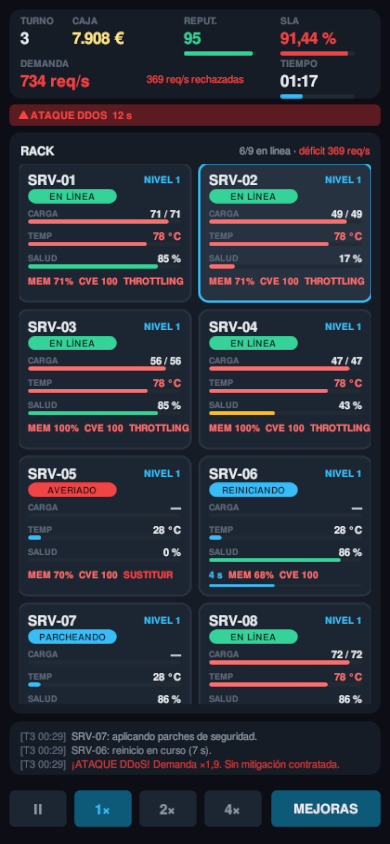
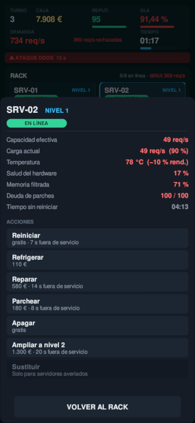
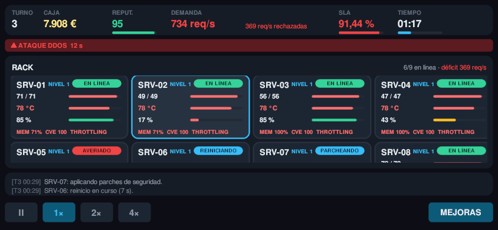
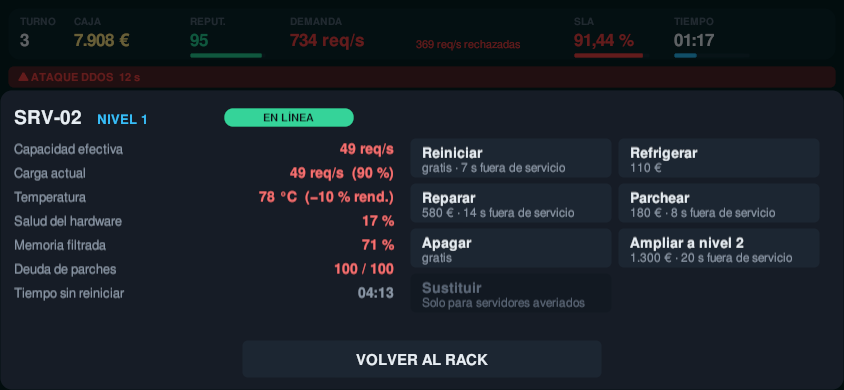

<div align="center">

# UPTIME · Turno de Noche

**Un rack. Un técnico. Toda la noche.**

Simulador de mantenimiento de un centro de datos en tiempo real.
Tú contra la entropía, y la entropía tiene mejor uptime.


</div>

<br>


<div align="center"><sub>Turno 3. Un DDoS y una avería de climatización a la vez. Seis máquinas en <i>throttling</i>, una averiada, dos en mantenimiento y 363 peticiones por segundo cayéndose al suelo.</sub></div>

<br>

---

## El bucle

El balanceador reparte el tráfico entre los servidores que están en línea. Todo lo que no
se atiende cuesta **dinero** y **reputación**. Cada turno entra más tráfico que el anterior.
Si la reputación llega a cero, se acabó el contrato.

Eso es todo. La dificultad no está en las reglas, está en que las cuatro cosas que se rompen
se rompen a la vez y la solución de una empeora las otras.

## Las cuatro amenazas

| | Qué pasa | Cómo se para | Lo que te cuesta |
|:--:|---|---|---|
| 🔥 | **Calor.** Por encima de 76 °C la máquina rinde menos (*throttling*) y se desgasta más rápido | Reparto de carga, refrigeración forzada o refrigeración líquida | 110 € y 16 s de recarga por máquina |
| 🧠 | **Fugas de memoria.** Se comen hasta el 45 % de la capacidad | Solo se limpian reiniciando | 7 s fuera del balanceador |
| 🔓 | **Deuda de parches.** Sube sola. Un escaneo por encima de 45 puntos = brecha | Parchear, o contratar parcheo automático | 180 € y 8 s — o multa y −14 de reputación |
| ⚙️ | **Desgaste.** A 0 % de salud la máquina se avería | Reparar antes; sustituir después | Reparar ≈ 7 €/punto · Sustituir 1.500 € |

Y encima, sin avisar: picos de tráfico, ataques DDoS, fallos de disco, averías de
climatización y picos de tensión que dejan una máquina inservible.

## El dilema central

> Para arreglar un servidor tienes que sacarlo del balanceador.
> Y lo sacas justo cuando más capacidad necesitas.

Mantener margen de capacidad no es prudencia: es la única forma de poder hacer mantenimiento
sin que se caiga el servicio. Ir al límite funciona, hasta que un disco se rompe y ya no
puedes permitirte apagar nada. A partir de ahí solo miras cómo baja el número.

---

## Galería

<table>
<tr>
<td width="50%"><br><sub><b>Cierre de turno.</b> SLA, ingresos, penalizaciones y prima. Los números no mienten.</sub></td>
<td width="50%"><br><sub><b>Mejoras permanentes.</b> Ocho líneas de inversión. Nunca hay dinero para todas.</sub></td>
</tr>
</table>

---

## Jugar en el navegador

**La forma más rápida, sin instalar nada.**

### ▶ https://izanvil.github.io/rack-and-ruin/

La build **no se versiona en `main`**: se compila en local y se publica a una rama huérfana
`gh-pages` que se reescribe entera en cada publicación. Así ni `main` ni `gh-pages` acumulan
los ~5 MB de binarios de cada versión.

Cuatro cosas que solo pasan en el navegador:

- **Si cambias de pestaña, la partida se pausa sola.** El navegador deja de dar frames a las
  pestañas que no se ven, y al volver entregaría de golpe todo el tiempo transcurrido. Se
  pausa y se queda pausado, para que vuelvas a un rack que puedas mirar antes de que el
  reloj siga.
- **Si cierras la pestaña, la partida te espera.** Ver *[Cerrar la pestaña no cuesta la
  partida](#cerrar-la-pestaña-no-cuesta-la-partida)*.
- **En el móvil se juega igual.** Ver *[En un móvil](#en-un-móvil)*.
- **Los ficheros llevan el hash del contenido en el nombre**, así que al publicar una
  versión nueva nadie se queda con la anterior en la caché.

Para probarla en local antes de publicar:

```bash
./tools/servir-web.sh        # sirve en http://localhost:8000
```

Y para regenerarla tras cambiar el juego:

```bash
./tools/build-web.sh         # recompila Build/WebGL/ (tarda unos minutos)
```

Y para publicarla:

```bash
./tools/publicar-web.sh                  # compila y publica
./tools/publicar-web.sh --sin-compilar   # publica la build que ya haya
```

El commit de `gh-pages` lleva el SHA de `main` del que salió la build, así que siempre se
puede saber qué código hay publicado. Si el árbol está sucio al publicar, avisa.

> **Puesta en marcha (una sola vez):** en el repo, **Settings → Pages → Source: Deploy from
> a branch**, rama `gh-pages`, carpeta `/ (root)`.

**Pesa 5,4 MB.** Ver *[Lo que no está en la build](#lo-que-no-está-en-la-build)*.

---

## Lo que no está en la build

En algo que se comparte por enlace, el tamaño de la primera carga es la métrica que más
importa: es el tiempo que alguien mira una barra de progreso antes de decidir si le
interesa. Estaba en 7,3 MB y ahora está en **5,4 MB**, un 26 % menos, sin tocar una línea
de lógica.

| | Antes | Ahora |
|---|---:|---:|
| `.wasm` | 5,64 MB | **4,02 MB** |
| datos | 1,29 MB | **1,00 MB** |
| total | 7,3 MB | **5,4 MB** |

Salió de tres sitios:

**El manifiesto traía los 32 módulos por defecto.** Cloth, terrain, vehicles, navmesh,
partículas, física 2D y 3D, vídeo, VR, XR, los cuatro `unitywebrequest`… El juego no usa
ninguno: es una interfaz de uGUI construida por código, con sonido sintetizado y cero
assets binarios. Quedan seis (`audio`, `imageconversion`, `imgui`, `jsonserialize`, `ui`,
`uielements`) y un módulo que no está en el manifiesto no entra en la build, que es bastante
más efectivo que confiar en que el podador lo quite.

**El podado de código gestionado estaba sin fijar.** Ahora va en `High` desde
`BuildTools.ConfigureWebGL`. El juego no carga nada por nombre ni usa reflexión sobre tipos
propios, así que se puede podar al máximo.

**Sobraba el paquete de Input System.** La entrada estaba en modo «ambos» y se empaquetaban
los dos sistemas, cuando el juego solo usa el `Input` clásico. `GameUi.EnsureEventSystem`
busca el módulo del paquete por reflexión y, al no encontrarlo, cae solo en
`StandaloneInputModule`, que en el navegador maneja ratón y dedo igual. La prueba de humo
comprueba que el EventSystem acaba con un módulo de entrada: quedarse sin ninguno dibujaría
la interfaz entera sin que respondiera a un solo toque, y eso no lo delata ningún error de
compilación.

> **Un `link.xml` que no hizo falta.** `JsonUtility` lee los campos de la partida guardada
> por reflexión, que es justo lo que el podador no ve, así que se añadió uno para
> conservarlos. Al comprobarlo —compilando con él y sin él y buscando los nombres de los
> campos dentro del `.wasm` y del fichero de datos— resultó que Unity ya los conserva solo:
> las dos builds salieron con los mismos 4,02 MB y los mismos campos dentro. Se quitó.

---

## En un móvil

Antes la página se negaba a cargar por debajo de 720 px: la interfaz estaba hecha a
1600×900 y en un teléfono los números del rack no se leían. Ya no hay puerta.

<table>
<tr>
<td width="50%"><br><sub><b>Vertical.</b> Dos columnas con scroll, consola de tres líneas y los controles abajo, donde llega el pulgar.</sub></td>
<td width="50%"><br><sub><b>La hoja.</b> Tocar una máquina la sube con sus medidas y sus siete acciones. Se cierra tocando fuera.</sub></td>
</tr>
</table>



<sub><b>Tumbado.</b> Cuatro columnas de tarjeta baja y el HUD de vuelta a una sola fila:
aquí lo que falta es alto, no ancho.</sub>

<br>



<sub><b>Y su hoja, repartida en dos:</b> medidas a la izquierda, las siete acciones a la
derecha. Apilada, las acciones caerían bajo el pliegue, que es justo para lo que se abre.</sub>

<br>

**No es la de escritorio encogida.** La referencia del lienzo pasa de 1600 a 420 unidades,
que es el ancho de un móvil en píxeles CSS, así que un botón de 42 unidades mide 42 píxeles
reales y se puede tocar. Encoger la otra dejaría el texto de 10 px en 2,4.

Y tumbado tampoco vale la de vertical: allí falta ancho y sobra alto, y tumbado es justo al
revés. Son **tres disposiciones**.

| | Escritorio | Móvil en vertical | Móvil tumbado |
|---|---|---|---|
| **Referencia** | 1600 × 900 | 420 de ancho | 390 de alto |
| **Rack** | 5 columnas | 2 columnas con scroll | 4 columnas, tarjeta baja |
| **Inspector** | columna fija | hoja inferior | hoja inferior, en dos columnas |
| **Velocidad y mejoras** | esquina del HUD | barra inferior | barra inferior |
| **HUD** | una fila de seis | dos filas | una fila de seis |
| **Consola** | 8 líneas | 3 líneas | 2 líneas |

**La tarjeta baja** sube el estado a la línea del nombre y quita los rótulos
CARGA/TEMP/SALUD, que se deducen del orden y del color. Cuesta un vistazo más y devuelve 42
unidades de alto por tarjeta, que tumbado es una fila entera de rack.

**Donde falta alto, se usa el ancho.** Tumbado sobran 860 unidades a lo ancho y solo hay
390 de alto, así que lo que no cabe apilado se reparte en dos columnas: el inspector, el
texto de la portada y las ocho filas del cierre de turno. La alternativa era el scroll, y se
probó: una lista cortada por la mitad se lee como lista, pero un párrafo cortado a media
frase se lee como algo roto. **La única que conserva scroll es la tienda**, porque ocho
mejoras no caben de ninguna manera.

La decisión la toma `UiLayout.KindFor` a partir del tamaño de la ventana **en píxeles CSS**,
que la página mide y le pasa al juego. No vale `Screen.width`: el lienzo se renderiza a 2x o
3x para que el texto salga nítido, así que un teléfono de 390 px reporta más de 1.100 y
cualquier umbral fallaría.

```
vertical (proporción < 1,2)          → compacta
apaisada y ≥ 820 × 560               → escritorio
apaisada por debajo de eso           → tumbada
```

Al girar el teléfono la interfaz **se reconstruye entera**, porque las dos disposiciones no
son la misma a otra escala. La partida no se entera: sigue viva detrás, y lo que estuviera
abierto —la portada, el resumen del turno, el fin de partida— se vuelve a montar.

> **El único suelo está en 300 × 240 píxeles**, por debajo del cual no hay disposición que
> aguante. No lo cruza ningún móvil —el más pequeño da 320 × 568, y tumbado 568 × 320—: es
> la ventana de escritorio que alguien ha dejado en una rendija. Ahí se pausa y se avisa.

Tres detalles que sin ellos no se juega bien con el dedo:

- **El umbral de arrastre se escala con el lienzo.** uGUI separa el toque del arrastre en
  píxeles de pantalla, pero el búfer va a 2x o 3x: sin corregirlo, un toque limpio se
  pasaría de diez píxeles y el juego lo tomaría por scroll.
- **`touch-action: none` en el lienzo.** El rack tiene scroll propio; si el navegador se
  queda el arrastre para desplazar la página, se pelean.
- **El supersampling se topa en 2x en móvil.** A pantalla completa con
  `devicePixelRatio` 3 serían casi tres millones de píxeles por frame: se notan en la
  batería y no se ven.

---

## El turno del día

La simulación es determinista: una semilla fija la partida entera —qué incidencias caen,
cuándo caen y sobre qué máquina—, así que dos personas con la misma semilla juegan el mismo
rack y sus resultados se pueden comparar.

Por defecto la semilla es **la fecha de hoy en UTC**, con formato `aaaammdd`. Todo el mundo
que entre hoy se encuentra el mismo turno. En la portada está la alternativa: **partida
libre**, con semilla al azar, para cuando lo que quieres es jugar y no competir.

Al terminar, el botón **Copiar resultado** deja en el portapapeles algo así:

```
UPTIME · Turno de Noche
Turno del día 21/09/2026
7 turnos · 2,4M peticiones · 1.420 €
Puntuación 9.320
https://izanvil.github.io/rack-and-ruin/?seed=20260921
```

Quien abra ese enlace no juega a algo parecido: juega exactamente a eso. Cualquier número
vale como semilla, así que `?seed=1234` también funciona.

> **El determinismo no sale gratis.** `System.Random` no garantiza la misma secuencia entre
> implementaciones del runtime, así que la misma semilla podía dar partidas distintas en el
> editor y en la build de WebGL. El generador es propio (`Rng.cs`, un xorshift32 de doce
> líneas) y la prueba de humo comprueba que dos partidas con la misma semilla terminan
> idénticas —y que dos semillas distintas no—.

## Cerrar la pestaña no cuesta la partida

La partida se guarda sola cada cinco segundos mientras corre el reloj, y además al cerrar un
turno y cada vez que la ventana pierde el foco. Al volver, la portada ofrece **continuar**.

Se guarda el estado completo: cada servidor con su temperatura, su desgaste y la tarea que
tuviera a medias, las incidencias activas con lo que les queda, las mejoras compradas, la
caja, la reputación y **el estado del generador aleatorio**, que es lo que hace que la
partida recuperada siga siendo la misma y no una nueva con los mismos números.

Se reanuda siempre **en pausa**, por el mismo motivo por el que se pausa al cambiar de
pestaña: vuelves a un rack que lleva horas parado y merece una mirada antes de que el reloj
siga.

Vive en `PlayerPrefs`, que en WebGL es IndexedDB: sobrevive a cerrar la pestaña, que es el
accidente del que protege. Es una única ranura y se borra al terminar la partida — esto no
es un sistema de partidas guardadas, es un seguro.

---

## Jugar

**Sin tocar la terminal.** Instala el lanzador una vez:

```bash
./tools/instalar-acceso-directo.sh
```

Deja el juego en el menú de aplicaciones y un icono en el escritorio. Clic derecho sobre él
→ *Abrir en ventana* si no lo quieres a pantalla completa. Para quitarlo,
`./tools/instalar-acceso-directo.sh --desinstalar`.


También vale ejecutarlo directamente:

```bash
./Build/Uptime.x86_64
```

O abre la carpeta desde Unity Hub (*Add project from disk*) con **Unity 6000.0.82f1** y pulsa
**Play**. La escena `Assets/_Project/Scenes/Main.unity` ya está en *Build Settings*.

> El juego arranca incluso desde una escena vacía: si al entrar en modo Play no existe ningún
> `GameBootstrap`, se crea uno solo mediante `[RuntimeInitializeOnLoadMethod]`.

### Controles

En móvil se toca: una máquina abre su detalle, y la pausa, la velocidad y las mejoras están
en la barra de abajo. Con teclado:

| | | | |
|---|---|---|---|
| `Espacio` Pausa | `1` `2` `3` Velocidad ×1 ×2 ×4 | `Tab` Siguiente incidencia | `M` Mejoras |
| `R` Reiniciar | `E` Refrigerar | `A` Reparar | `P` Parchear |
| `Esc` Cerrar tienda | `N` Silenciar | | |

---

## Arquitectura

<details>
<summary><b>Estructura de carpetas</b></summary>

```
Assets/_Project/Scripts/
├── Core/                    Simulación y reglas. C# puro salvo GameBootstrap.
│   ├── GameBootstrap.cs     Punto de entrada. Crea la sesión y la interfaz.
│   ├── GameSession.cs       Estado, ciclo de turnos, acciones, economía.
│   ├── GameConfig.cs        ScriptableObject con todo el equilibrio.
│   ├── ServerUnit.cs        Un servidor: térmica, desgaste, tareas.
│   ├── Rack.cs              Balanceo de carga por llenado.
│   ├── IncidentSystem.cs    Incidencias y efectos temporales.
│   ├── Upgrades.cs          Catálogo de mejoras y modificadores.
│   ├── Rng.cs               Generador aleatorio propio, con estado guardable.
│   ├── RunSeed.cs           Semilla del día, ?seed= de la URL y enlaces.
│   └── SaveGame.cs          Retrato de la partida y ranura en PlayerPrefs.
├── Events/
│   └── GameEvents.cs        Bus de eventos por instancia y sus payloads.
├── UI/                      Interfaz, construida enteramente por código.
│   ├── UiLayout.cs          Medidas de cada disposición y cuál toca.
│   ├── GameUi.cs            Monta el lienzo y coordina las vistas.
│   ├── Ui.cs                Fábrica de widgets y helpers de anclaje.
│   ├── UiTheme.cs           Paleta y tipografía.
│   ├── HudView.cs           Barra superior y franja de incidencias.
│   ├── RackView.cs          Rejilla de servidores y bahías libres.
│   ├── ServerCardView.cs    Tarjeta de un servidor.
│   ├── InspectorView.cs     Detalle y acciones.
│   ├── LogView.cs           Consola de eventos.
│   ├── UpgradesView.cs      Tienda modal.
│   ├── OverlayView.cs       Intro, cierre de turno y fin de partida.
│   └── TooSmallView.cs      Aviso para la ventana en rendija.
├── Utils/
│   ├── Fmt.cs               Formateo de números y tiempos.
│   ├── TextureFactory.cs    Sprites generados por código (SDF).
│   ├── Sfx.cs               Sonido sintetizado.
│   ├── Share.cs             Resultado en texto y copia al portapapeles.
│   └── Viewport.cs          Tamaño de la ventana en píxeles CSS.
└── Editor/
    ├── SmokeTest.cs         Prueba de humo y banco de equilibrio.
    ├── SceneBuilder.cs      Escena y asset de configuración.
    ├── BuildTools.cs        Compilación del ejecutable.
    └── ScreenshotTool.cs    Capturas renderizadas a PNG.
```

</details>

### Seis decisiones que explican el resto del código

**Cero assets binarios.** Los sprites son rectángulos redondeados generados con una función
de distancia con signo, el sonido son tonos sintetizados con envolvente y la tipografía es la
que trae Unity de serie. No hay ni un `.png` ni un `.wav` ni un prefab en todo el proyecto:
la carpeta `Assets/_Project` se copia a otro proyecto y funciona tal cual.

**La lógica no sabe que existe una interfaz.** `GameSession.GetActions(unit)` devuelve qué
acciones hay, cuánto cuestan, cuánto tardan y **por qué** están o no disponibles. La interfaz
solo las pinta. Añadir una acción nueva no obliga a tocar ni una línea de UI.

**Bus de eventos por instancia, no estático.** Un bus estático deja suscriptores colgados
entre partidas cuando el *domain reload* está desactivado, que es el fallo clásico. Los
sucesos puntuales van por el bus; los valores numéricos se leen por sondeo cada frame, que
con este número de widgets sale más simple y más barato.

**Paso de simulación troceado.** `GameSession.Tick` parte el delta en pasos de 50 ms como
máximo. La térmica y el desgaste no dependen de los FPS ni se descuadran a velocidad ×4.

**Nada de aleatoriedad del sistema.** Ni `System.Random` ni `UnityEngine.Random`: todo el
azar sale de un `Rng` propio que se pasa por parámetro a quien lo necesita. Cuesta un
argumento más en tres firmas y a cambio la partida es reproducible entre plataformas y su
estado cabe en un `uint`, que es lo que permite guardarla y recuperarla sin que cambie.

**Realimentación térmica acotada a propósito.** El calor se calcula contra la capacidad
*nominal*, no contra la efectiva. Si no, el *throttling* reduciría la capacidad, lo que
subiría la ocupación, lo que subiría el calor: una espiral de la que es imposible salir.
Así el throttling duele sin ser una sentencia.

---

## Herramientas del editor

Menú **Server Game** en Unity. Todas funcionan también desde línea de comandos.

| Herramienta | Qué hace |
|---|---|
| **Ejecutar prueba de humo** | Juega 5 partidas automáticas, comprueba las invariantes del modelo, verifica que la semilla es determinista y que una partida guardada vuelve igual, clasifica tamaños de ventana, construye la interfaz entera **en las tres disposiciones** y ejercita las 7 acciones y las 8 mejoras. Informa de fallos **y del equilibrio**. |
| **Capturar pantallas** | Renderiza las pantallas a PNG sin entrar en modo Play, en las tres disposiciones: 1600×900, 390×844 y 844×390, que son tamaños reales. |
| **Compilar ejecutable** | Genera la build de Linux. |
| **Compilar para web (WebGL)** | Genera la build WebGL con la portada del juego. |
| **Crear escena principal** | Regenera `Main.unity` y la añade a *Build Settings*. |
| **Crear asset de configuración** | Crea `Settings/GameConfig.asset` para tocar el equilibrio desde el Inspector. |

```bash
UNITY=~/Unity/Hub/Editor/6000.0.82f1/Editor/Unity

# Prueba de humo — sale con código 1 si algo falla, así que vale para CI
"$UNITY" -batchmode -nographics -quit -projectPath . \
  -executeMethod ServerGame.EditorTools.SmokeTest.RunBatch -logFile -

# Compilar
"$UNITY" -batchmode -nographics -quit -projectPath . \
  -executeMethod ServerGame.EditorTools.BuildTools.BuildLinux \
  -buildOutput Build/Uptime.x86_64 -logFile -

# Capturas — necesita servidor gráfico, por eso sin -nographics
"$UNITY" -batchmode -quit -projectPath . \
  -executeMethod ServerGame.EditorTools.ScreenshotTool.CaptureBatch \
  -screenshotOutput docs -logFile -
```

---

## Equilibrio

Los números no están puestos a ojo: salen de la prueba de humo, que juega cinco partidas
completas con un jugador automático que hace mantenimiento razonable.

| Jugador | Turnos que aguanta |
|---|---|
| No hace nada | **3** |
| Mantenimiento razonable | **8,2 de media** (peor 7, mejor 9) |
| Usando bien las mejoras | más |

Para ajustarlo: menú **Server Game → Crear asset de configuración**, y lo asignas al campo
*Config* del objeto `[Server Game]` de la escena.

| Campo | Qué mueve |
|---|---|
| `demandGrowthPerDay` | Cuánto sube el tráfico cada turno. **Es la dificultad principal.** |
| `serverBaseCapacity` | Peticiones por segundo de un servidor de nivel 1. |
| `revenuePerThousandServed` | Ritmo al que entra el dinero. |
| `wearPerSecondAtFullLoad` · `heatWearMultiplier` | Cada cuánto hay que reparar. |
| `memoryLeakPerSecond` | Cada cuánto hay que reiniciar. |
| `incidentIntervalBase` | Frecuencia de las incidencias. |
| `coolingCooldownSeconds` | Cuánto se puede abusar de la refrigeración forzada. |

> Después de tocar cualquier cosa, **vuelve a pasar la prueba de humo**. Te avisa si el juego
> se ha vuelto imposible o trivial, y te da la curva de turnos para comprobarlo.

---

<div align="center">
<sub><b>rack-and-ruin</b> · <i>to go to rack and ruin</i>: irse al garete.<br>
Aquí es literal.</sub>
</div>
